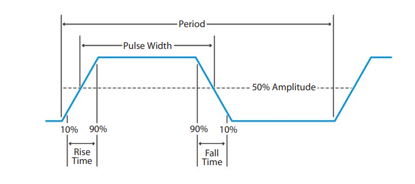
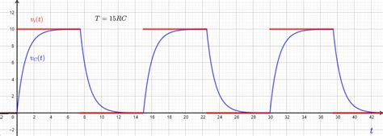

# Direct Drive sim racing harness tension test rig
 An [Arduino sketch](https://github.com/blekenbleu/Arduino-Blue-Pill/tree/main/blek2byte) 
 and [SimHub Custom Serial profile](https://raw.githubusercontent.com/blekenbleu/SimHub-profiles/main/Fake8.shsds) 
 for scooter motor [**PWM**](PWM.md) torque control:  
   
 ...these will employ the [Fake8 SimHUb plugin](https://github.com/blekenbleu/Fake8) for sending 8-bit commands
 to the [Arduino sketch](https://github.com/blekenbleu/Arduino-Blue-Pill/tree/main/blek2byte).

Several Sim racing harness tensioners use either stepper motors or hobby/robot servo motors,  
either choice being IMO suboptimal:
- gears generate noise and kill responsiveness
- neither directly applies tension; they instead simply move some amount.

A few tensioners already use PWM control of DC motors,
where PWM % directly relates to stall torque (tension).  
A stalled electric motor generates no [back EMF](https://en.wikipedia.org/wiki/Counter-electromotive_force),
consequently needing much lower than rated motor Voltage.  
[Electric scooter motors](https://www.amazon.com/dp/B09KRGZX3G?tag=racedep-20)
seemingly deliver appropriate torque for direct drive harness tensioning, [as discussed here](https://www.racedepartment.com/threads/2dof-harness-tensionner-with-fly-ptmover.194331/page-9#post-3531954).  
  
... driven by [BTS7960 43A Motor Drivers](https://electropeak.com/learn/interfacing-bts7960-43a-high-power-motor-driver-module-with-arduino/):
  

Since scooter motors are [not designed](https://support.electricscooterparts.com/support/discussions/topics/1000087804)
for use as [traction motors](https://en.wikipedia.org/wiki/Traction_motor),
  
... some information is lacking to use mostly stalled:
- What PWM frequency minimizes coil whine while not compromising torque control?
- [What range of PWM values is safe and useful](https://www.allaboutcircuits.com/textbook/semiconductors/chpt-11/pulse-width-modulation/)?
- How responsively can tension (motor torque) slew?  
  Substantial changes will involve appreciable shaft rotation, generating back EMF.  
- Are brief predistortion pulses wanted for more responsive torque application and release?
   - If so, how much and for how long?

Testing will employ this waveform, sampled at SimHub 60Hz rate:  
  

At least 9 controls are wanted for testing:
- test period  (60 = 1 second)
- rise time (0 to period/3)
- hold time (0 to period/3)
- fall time (0 to period/3)
- max signal magnitude
- min signal magniitude

Up to 5 signals to Blue Pill:  
- Testing sample values driving PWM %
- PWM frequency &nbsp; ( ~ 20kHz?)
- predistortion amplitude (% of sample value changes) to compensate slew rate limits:
  
- predistortion duration (Blue Pill Arduino loop() cycle count)  
  worst case, scooter motor may want brief negative predistortion to relax tension,  
  consuming both sides of an "H" PWM driver per motor:  
    
- optional reference measurements to echo, along with sample values,  
  for capture from SimHub "Incoming serial data" e.g. to plot,
  where reference tension measurements may be captured from a sim brake pedal load cell.
  
This wants [**multi-byte control for SimHub Custom serial devices**](https://github.com/blekenbleu/Arduino-Blue-Pill/blob/main/8-bit.md) 
 to handle that many variables.  

### [Fake8](https://github.com/blekenbleu/Fake8) SimHub plugin drives [PWM_FullConfiguration](https://github.com/blekenbleu/Arduino-Blue-Pill/tree/main/PWM_FullConfiguration)  
*16 Mar 2023* A derivative plugin will add test waveform by [Bresenham Line Generation](https://www.geeksforgeeks.org/bresenhams-line-generation-algorithm/), minimizing discontinuity:  
- changes increasing amplitude will start in ramp-up section
- changes decreasing amplitude start in ramp-down section
- receipt of a control change from Custom Serial profile will cause `Parse()` to set a `Change` flag
- `true == Change` will cause interval and slope recalculations at the next `DataUpdate()` invocation.

### Fake8 installation
*21 Mar 2023* copied source files:
- .gitignore
- Fake7.cs
- Fake8.cs
- Fake8.csproj
- NCalcScripts/F8.ini  

**Visual Studio:  project.assets.json not found**
- cmd.exe shell:&nbsp;  `> dotnet restore`
